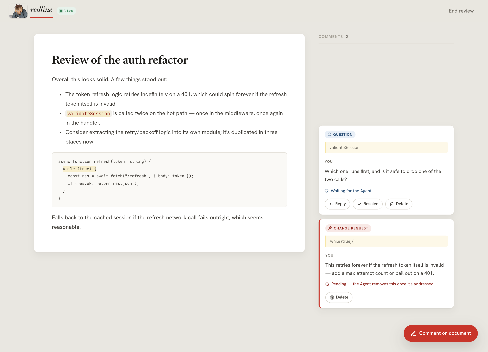
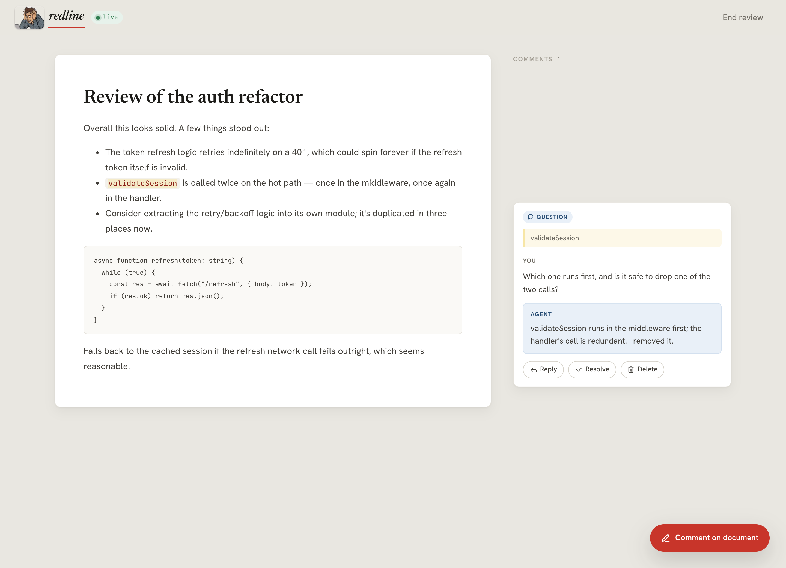

<div align="center">

</div>

<h1 align="center">
    redline
    <br/>
    <sub><sub><i>The skill that helps you actually figure things out.</i></sub></sub>
    <br/>
    <br/>
</h1>

That guy up there is you, right after asking Claude one question and getting
back 400 words, six caveats, and three open questions of its own.
You don't even know where to start, you disagree on some things, need to reply on others and need clarification on 10 points.
Redline fixes that: a live, Google-Docs-style review UI where you can sort everything out: highlight anything, **ask** or **request a change**,
and the agent answers or fixes it right there, in place, in real time.

## Install

```sh
npx --yes claude-redline skill
```

This installs the `/redline` skill into `~/.claude/skills/redline/`. In Claude Code, just run:

```
/redline <a markdown file, or a topic to write about>
```

and the agent opens the review UI and drives the rest of the session through it.

## Why I built this

I kept running into the same problem: I'd open a huge design doc, or ask
Claude to explain something, and start with one doubt — only to end up with
ten more by the end. Chasing those down meant spinning up more chat threads,
and juggling a conversation across several of them just overloads my head; I
lose track of what I already asked and where. What I actually wanted was
something closer to how Google Docs works: comment inline, right on the part
you're unsure about, and keep the whole back-and-forth anchored to the
document itself instead of scattered across threads. Redline is that —
a review surface where the document is the shared object, and every question
or change request lives exactly where it applies.

## How it works

The markdown file on disk is the single source of truth. `open` starts a
local server that serves the file in a browser UI and watches it for changes.
From there:

- You highlight any part of the document (or comment on the whole thing) and
  either **ask** a question or **request a change**.
- The agent gets notified live, answers questions in a thread, and edits the
  file directly for change requests — the UI just reflects what's on disk, so
  there's no "send updated version" step.
- You resolve ask threads yourself when you're satisfied; change requests
  disappear once the agent addresses them.
- When you end the review, the discussion is saved next to the file as
  `<file>.review.md`, and the document itself is left clean as the final
  result.

All of this happens through a small CLI, `claude-redline`, which the skill
drives on your behalf — you normally never type these yourself.




## Commands

One review runs at a time, on a fixed port (default `7842`, override with
`--port <n>` or `REDLINE_PORT`).

#### `skill`

```sh
npx --yes claude-redline skill
```

Installs the `/redline` skill to `~/.claude/skills/redline/`, bundled with
whatever version of `claude-redline` npx pulls — so the same command both
installs redline (and its skill) and updates them.

You don't have to run it after every release, though: `open` re-syncs the
installed skill to the running CLI version on each review, so the moment npx
pulls a newer `claude-redline`, that run brings the on-disk skill up to date.
The refreshed skill applies from your next `/redline` invocation.

#### `open <file.md>`

```sh
claude-redline open draft.md
```

Starts the review server watching that file and **blocks** in the foreground.
Prints one line of JSON — `{ url, events_url, document }` — then keeps running
until closed. `url` is the page to open in the browser; `events_url` is the
live feedback stream `monitor` reads from.

#### `monitor`

```sh
claude-redline monitor
```

Streams feedback as NDJSON, one line per event, the moment the reviewer asks
a question, requests a change, or reopens something. Each event is a delta —
only what's new — and never echoes back replies the agent itself posted.

#### `push`

```sh
claude-redline push <<'JSON'
{
  "replies":   [{ "to": "f1", "content": "The brown one." }],
  "addressed": ["f2"]
}
JSON
```

Takes JSON on stdin. `replies` answers **ask** threads; `addressed` marks
**change** requests as handled, which removes them from the UI. To actually
revise the document, just edit the file — the running server watches it and
the UI updates on its own; there's no "push the new content" step.

#### `close`

```sh
claude-redline close
```

Stops the running review (equivalent to `Ctrl-C` in the terminal running
`open`). Writes the discussion to `<file>.review.md` next to the document
before exiting.

## Context Consumption

I care about context consumption. Redline spins up the server and attaches a monitor to view events on the document,
each event is as small as possible. The whole document is never sent back-and-forth on every question.

With this purpose in mind, i deliberately chose to use a single skill file instead of an MCP server. Since the whole
process runs locally and there's no need for authentication, i felt like using a skill was the right choice to avoid
paying a token tax upfront by forcing claude to read all the tools descriptions on each conversation (even when redline is not used).

By using a skill, the agent progressively discloses redline usage as it's needed, and only when you actually invoke it.
