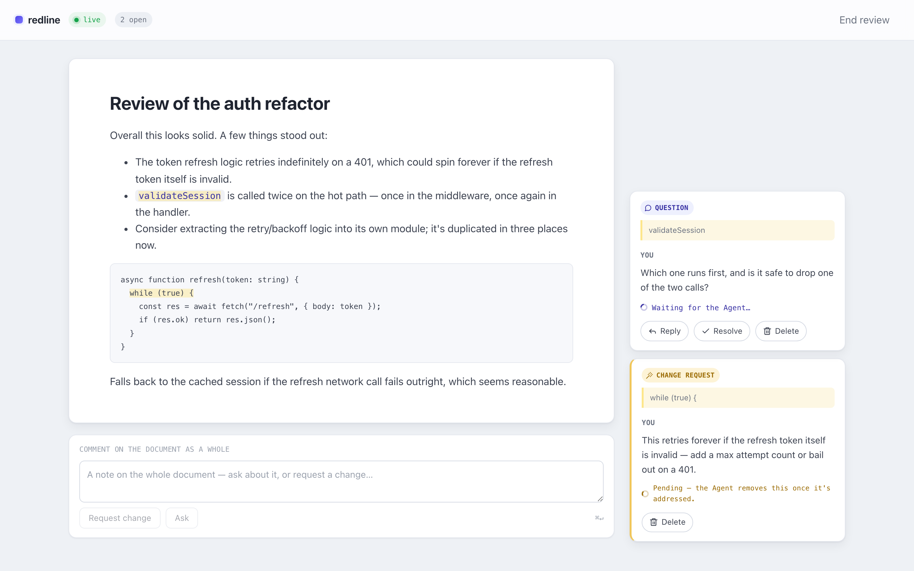

<center>
  
</center>

# redline

A live, Google-Docs-style review UI for giving an agent granular feedback on a
markdown document. Point redline at a **file**; you read it in the browser and,
on any part of it, **ask a question** or **request a change** (or comment on
the whole thing). Everything is realtime over a websocket — the agent sees
your feedback the moment you leave it, and its replies and edits appear in
your browser as they happen, no tab-switching or refreshing required. One
running server per file.

## Install

```sh
npx --yes claude-redline add-skill
```

This installs the `/redline` skill into `~/.claude/skills/redline/`. No
restart needed. In Claude Code, just run:

```
/redline <a markdown file, or a topic to write about>
```

and the agent opens the review UI and drives the rest of the session through
it.

## Why I built this

I kept running into the same problem: I'd open a huge design doc, or ask
Claude to explain something, and start with one doubt — only to end up with
ten more by the end. Chasing those down meant spinning up more chat threads,
and juggling a conversation across several of them just overloads my head; I
lose track of what I already asked and where. What I actually wanted was
something closer to how Google Docs works: comment inline, right on the part
you're unsure about, and keep the whole back-and-forth anchored to the
document itself instead of scattered across threads. Redline is that —
a review surface where the document is the shared object, and every question
or change request lives exactly where it applies.

## How it works

The markdown file on disk is the single source of truth. `open` starts a
local server that serves the file in a browser UI and watches it for changes.
From there:

- You highlight any part of the document (or comment on the whole thing) and
  either **ask** a question or **request a change**.
- The agent gets notified live, answers questions in a thread, and edits the
  file directly for change requests — the UI just reflects what's on disk, so
  there's no "send updated version" step.
- You resolve ask threads yourself when you're satisfied; change requests
  disappear once the agent addresses them.
- When you end the review, the discussion is saved next to the file as
  `<file>.review.md`, and the document itself is left clean as the final
  result.

All of this happens through a small CLI, `claude-redline`, which the skill
drives on your behalf — you normally never type these yourself.

<p align="center">
  
  
</p>

*Left: a question and a change request, both waiting on the agent. Right:
the agent replied to the question and fixed the code — the change request is
gone, the reply is in the thread.*

## Commands

One review runs at a time, on a fixed port (default `7842`, override with
`--port <n>` or `REDLINE_PORT`).

#### `add-skill`

```sh
claude-redline add-skill
```

Installs the `/redline` skill to `~/.claude/skills/redline/`. Every other
command also silently re-syncs an already-installed skill against the CLI's
own version, so this only needs to be run once.

#### `open <file.md>`

```sh
claude-redline open draft.md
```

Starts the review server watching that file and **blocks** in the foreground.
Prints one line of JSON — `{ url, events_url, document }` — then keeps running
until closed. `url` is the page to open in the browser; `events_url` is the
live feedback stream `monitor` reads from.

#### `monitor`

```sh
claude-redline monitor
```

Streams feedback as NDJSON, one line per event, the moment the reviewer asks
a question, requests a change, or reopens something. Each event is a delta —
only what's new — and never echoes back replies the agent itself posted.

#### `push`

```sh
claude-redline push <<'JSON'
{
  "replies":   [{ "to": "f1", "content": "The brown one." }],
  "addressed": ["f2"]
}
JSON
```

Takes JSON on stdin. `replies` answers **ask** threads; `addressed` marks
**change** requests as handled, which removes them from the UI. To actually
revise the document, just edit the file — the running server watches it and
the UI updates on its own; there's no "push the new content" step.

#### `close`

```sh
claude-redline close
```

Stops the running review (equivalent to `Ctrl-C` in the terminal running
`open`). Writes the discussion to `<file>.review.md` next to the document
before exiting.

## Why just a skill (no MCP)

I care about context consumption. An MCP server pays a token tax up front —
every tool definition sits in context for the entire conversation whether
you use it or not. A skill doesn't: it's a short description until it's
actually invoked, and only then does it disclose the detail needed to drive
the CLI. Redline is deliberately built around one skill wrapping a plain CLI,
so the cost only shows up when you actually run a review.

## Updating

There's no separate update step. Every time `claude-redline` runs, it checks
the installed skill against the version of the CLI you're using and syncs it
if they've drifted. So updating the package keeps the skill current for
free.
